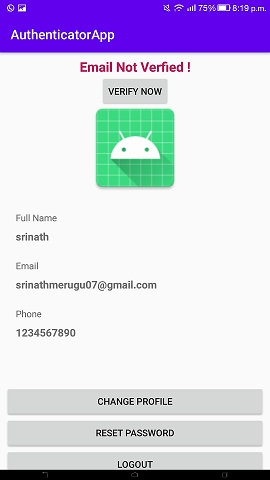
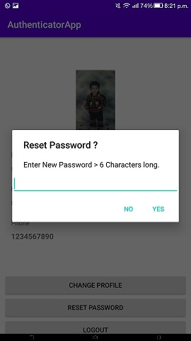

# Authentication-app
An android app using android studio and firebase to register a user and let the user login to the android app using some authentication features.

Language - Java

IDE - Android Studio

Database - Firebase 

#FEATURES
1. Implements firebase email authentication in an android app.
2. Reset a forgotten password using email. 
3. Verify Users Email in firebase.
4. Display profile information of users. 
5. Change the profile picture of users.

     
